# sparklo.in - Interactive Live Quiz Platform

<div align="center">
  
  <h3>Create, Host, and Participate in Live Quizzes</h3>
  <p>A real-time quiz platform built with React, Spring Boot, WebSocket, and Redis</p>
  
  [](https://sparklo-in.vercel.app)
</div>

---

## 🌟 Features

### For Hosts
- 🎯 **Quiz Builder** - Create custom quizzes with multiple question types
- 🎮 **Live Control Panel** - Manage quiz sessions in real-time
- 📊 **Analytics Dashboard** - Track participant performance and engagement
- 🔗 **QR Code Generation** - Easy participant joining via QR codes
- 📈 **Session History** - Review past quiz sessions and results
- 🤖 **AI Question Generator** - Generate questions using AI assistance

### For Participants
- ⚡ **Quick Join** - Enter room code and start playing instantly
- 🏆 **Live Leaderboard** - Real-time rankings and scoring
- 🎨 **Avatar Selection** - Choose from fun emoji avatars
- 📱 **Mobile Optimized** - Fully responsive for phones and tablets
- 🎯 **Time-Based Scoring** - Faster answers earn more points
- 🔥 **Streak Bonuses** - Consecutive correct answers boost your score

### Platform Features
- 🚀 **Real-Time Updates** - WebSocket-powered live interactions
- 🔐 **Secure Authentication** - JWT-based auth with role management
- 🎭 **Demo Access** - Try the platform without registration
- 🌐 **Landing Page** - Clear introduction to platform features
- 📱 **Mobile First** - Optimized for mobile devices and QR code joining

---
## Screenshots

### Host Dashboard
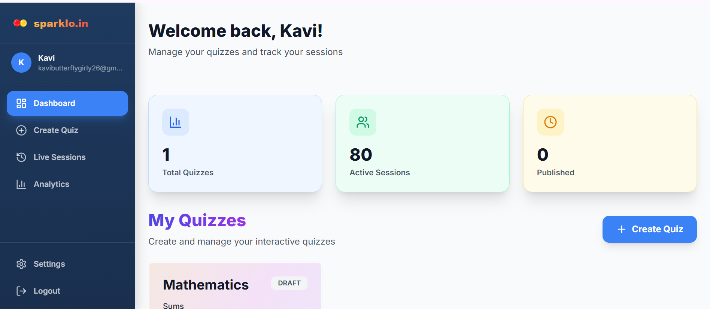

### Create Quiz
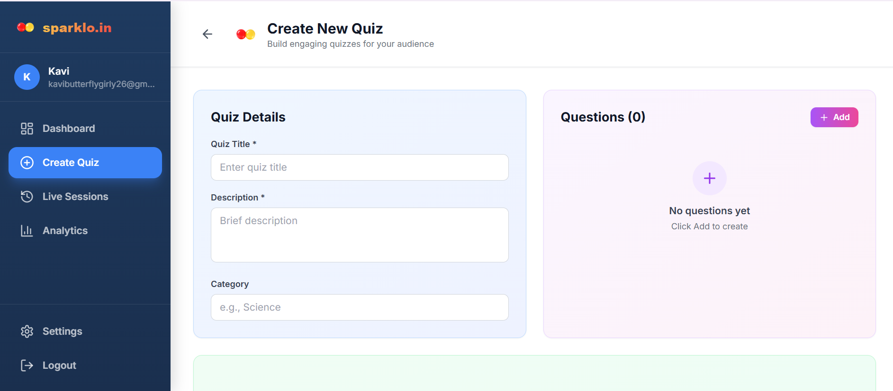

### Host Live Quiz
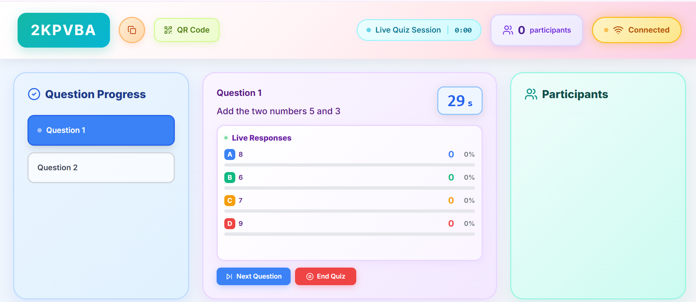

### Host Response Monitoring


### Analytics Dashboard
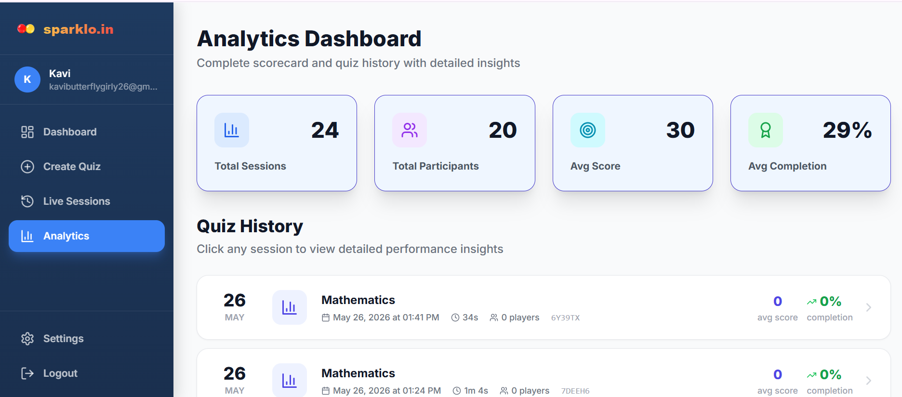

### Entire Host Analytics
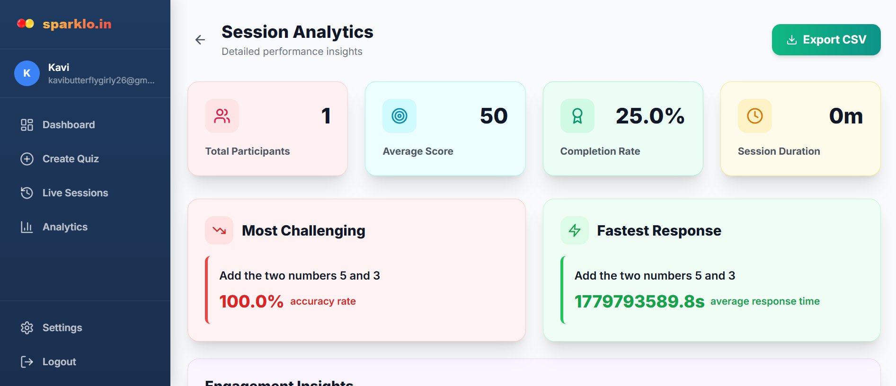

### Live Sessions
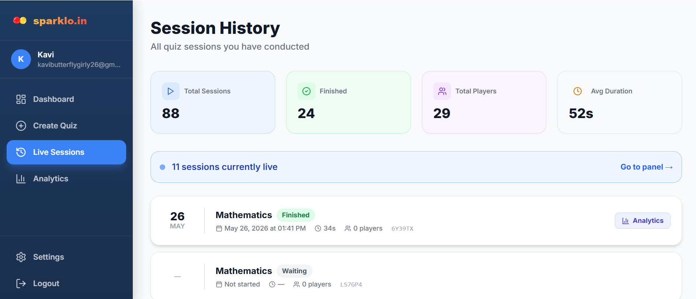

### Participant Join Quiz
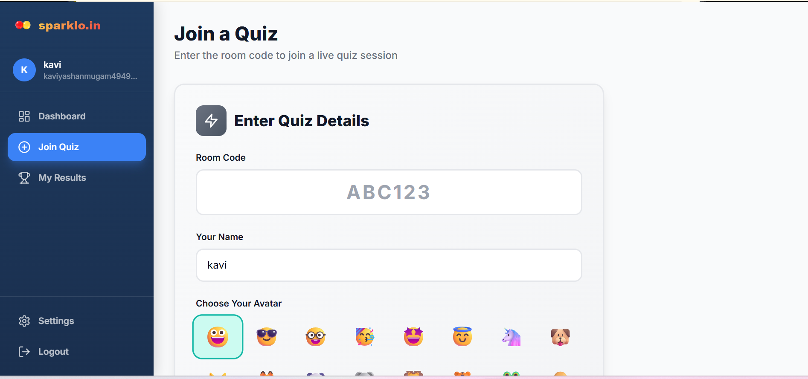

### Participant Waiting Room
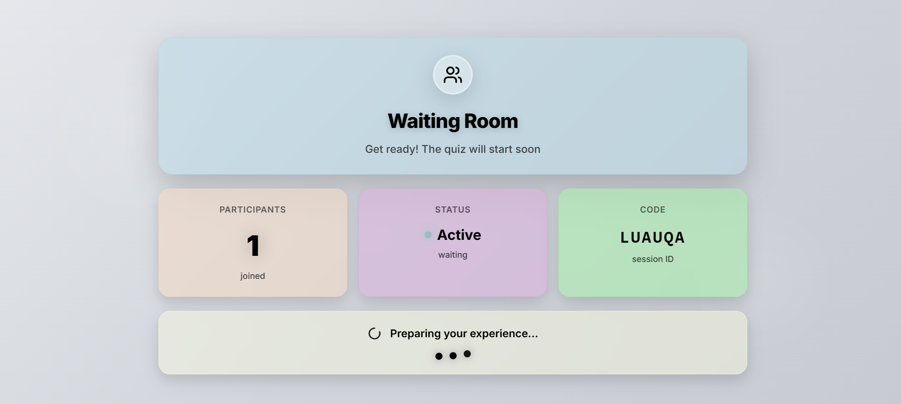

### Participant Quiz Interface
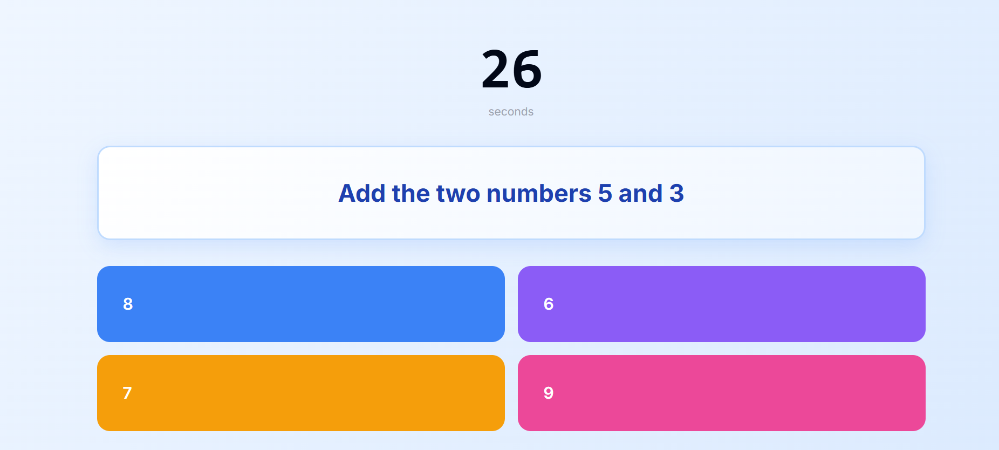

### Participant Live Score
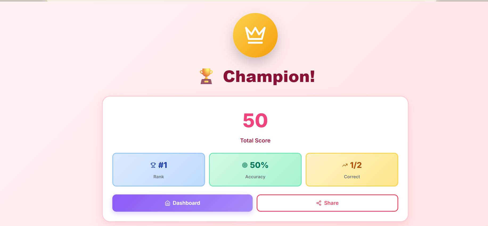

### Participant Quiz History
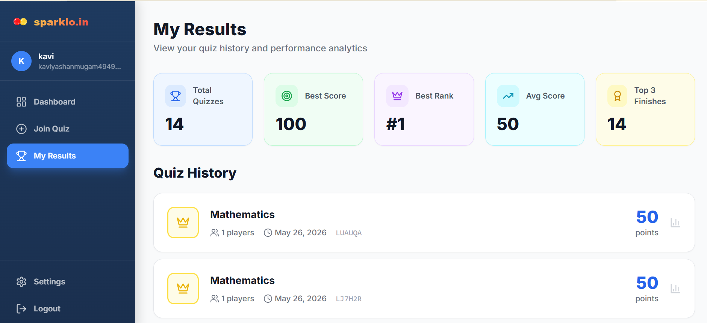

### Quiz Completion Screen
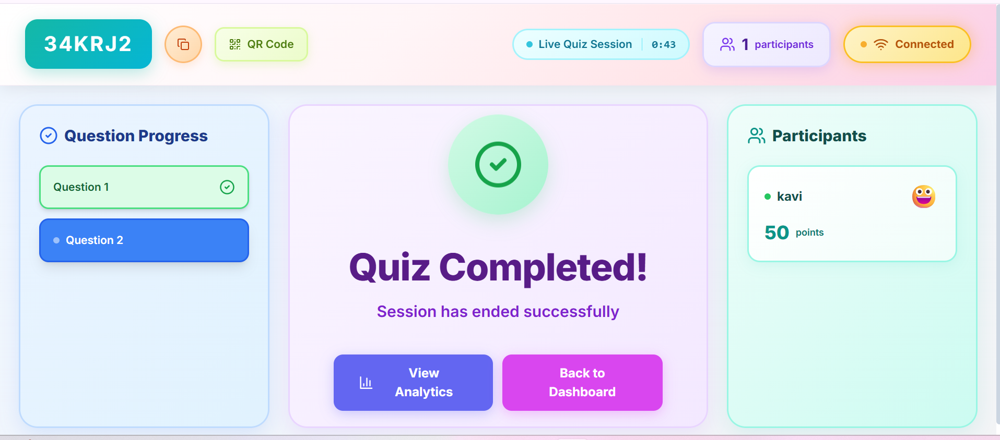

---

## 🚀 Live Demo

**Website:** [https://sparklo.in](https://sparklo.in)

### Try Demo Access

#### Demo Participant
1. Visit [sparklo.in](https://sparklo.in)
2. Click **"Demo Participant"** button on login page
3. Credentials auto-fill: `demo@sparklo.in` / `demo123`
4. Explore quizzes as a participant

#### Demo Host
1. Visit [sparklo.in](https://sparklo.in)
2. Click **"Demo Host"** button on login page
3. Credentials auto-fill: `demohost@sparklo.in` / `demo123`
4. Create and manage quizzes as a host

### Create Your Own Account
1. Click **"Sign Up"** on the landing page
2. Choose your role: **Host** or **Participant**
3. Start creating or joining quizzes!

---

## 📦 Tech Stack

### Frontend
- **Framework:** React 18 + TypeScript + Vite
- **Styling:** TailwindCSS
- **State Management:** Zustand
- **Routing:** React Router v6
- **API Client:** Axios + React Query
- **WebSocket:** @stomp/stompjs
- **Charts:** Recharts
- **Animations:** Framer Motion
- **Icons:** Lucide React

### Backend
- **Framework:** Spring Boot 3.2 + Java 21
- **Security:** Spring Security + JWT
- **Database:** PostgreSQL + Spring Data JPA
- **Real-time:** Spring WebSocket + STOMP
- **Caching:** Redis
- **Migrations:** Flyway
- **Storage:** MinIO (S3-compatible)
- **QR Codes:** ZXing

### Infrastructure
- **Frontend Hosting:** Vercel
- **Backend Hosting:** Render
- **Database:** PostgreSQL (Render)
- **Cache:** Redis (Render)
- **Storage:** MinIO

---

## 🏗️ Architecture

```
┌─────────────────┐
│   React SPA     │  (Vercel)
│  sparklo.in     │
└────────┬────────┘
         │ HTTPS/WSS
         ▼
┌─────────────────┐
│  Spring Boot    │  (Render)
│   REST + WS     │
└────────┬────────┘
         │
    ┌────┴────┐
    ▼         ▼
┌────────┐ ┌────────┐
│ PostgreSQL│ │ Redis  │
└────────┘ └────────┘
```

---

## 🎮 How to Use

### As a Host

1. **Sign Up** as a Host
2. **Create a Quiz**
   - Add questions with multiple choice answers
   - Set time limits and points
   - Upload images (optional)
3. **Start a Session**
   - Generate a unique room code
   - Share QR code or room code with participants
4. **Control the Quiz**
   - Start when participants are ready
   - Advance through questions
   - View live responses and leaderboard
5. **Review Analytics**
   - See detailed performance metrics
   - Export results

### As a Participant

1. **Join a Quiz**
   - Scan QR code or enter room code
   - Choose your display name and avatar
2. **Wait for Start**
   - See other participants joining
   - Get ready for the quiz
3. **Answer Questions**
   - Read and select your answer
   - Submit before time runs out
4. **Track Your Progress**
   - View your score after each question
   - See your position on the leaderboard
5. **View Final Results**
   - See your final rank
   - Review your answers

---

## 🛠️ Local Development Setup

### Prerequisites
- Node.js 20+
- Java 21
- Docker & Docker Compose
- Maven 3.9+

### 1. Clone the Repository

```bash
git clone https://github.com/yourusername/sparklo.git
cd sparklo/QuizLive
```

### 2. Start Infrastructure Services

```bash
docker-compose up -d
```

This starts:
- PostgreSQL (port 5432)
- Redis (port 6379)
- MinIO (port 9000, console: 9001)
- Mailhog (port 8025)

### 3. Start Backend

```bash
cd backend
mvn clean install
mvn spring-boot:run
```

Backend runs on: `http://localhost:8081`

**Verify:**
- Health: http://localhost:8081/actuator/health
- API Docs: http://localhost:8081/swagger-ui.html

### 4. Start Frontend

```bash
cd frontend
npm install
npm run dev
```

Frontend runs on: `http://localhost:3000`

### 5. Test the Application

1. Open http://localhost:3000
2. Register as a Host
3. Create a quiz
4. Start a session
5. Open incognito window and join as participant
6. Play through the quiz!

---

## 🌐 Deployment

### Frontend (Vercel)

```bash
cd frontend
npm run build
vercel --prod
```

**Environment Variables:**
```env
VITE_API_BASE_URL=https://your-backend.onrender.com/api
VITE_WS_URL=https://your-backend.onrender.com
```

### Backend (Render)

1. Create new Web Service on Render
2. Connect your GitHub repository
3. Set build command: `cd backend && mvn clean install`
4. Set start command: `cd backend && java -jar target/quiz-api.jar`
5. Add environment variables (database, Redis, etc.)

---

## 📚 API Documentation

### Authentication
- `POST /api/auth/register` - Register new user
- `POST /api/auth/login` - Login
- `POST /api/auth/logout` - Logout
- `POST /api/auth/refresh` - Refresh access token

### Quizzes (Host Only)
- `GET /api/quizzes` - List all quizzes
- `POST /api/quizzes` - Create new quiz
- `GET /api/quizzes/{id}` - Get quiz details
- `PUT /api/quizzes/{id}` - Update quiz
- `DELETE /api/quizzes/{id}` - Delete quiz

### Sessions (Host Only)
- `POST /api/sessions` - Create session
- `GET /api/sessions/{roomCode}` - Get session state
- `PATCH /api/sessions/{roomCode}/start` - Start session
- `PATCH /api/sessions/{roomCode}/next` - Next question
- `PATCH /api/sessions/{roomCode}/end` - End session
- `GET /api/sessions/{roomCode}/qr` - Get QR code

### Participants (Public)
- `POST /api/sessions/{roomCode}/join` - Join session
- `POST /api/sessions/{roomCode}/answer` - Submit answer
- `GET /api/sessions/{roomCode}/results` - Get results

### WebSocket Topics
- `/topic/session/{roomCode}` - Session state updates
- `/topic/session/{roomCode}/leaderboard` - Live leaderboard
- `/topic/session/{roomCode}/question` - Current question

---

## 🔐 Environment Variables

### Backend (.env or application.yml)
```yaml
spring:
  datasource:
    url: jdbc:postgresql://localhost:5432/quizlive
    username: postgres
    password: postgres
  redis:
    host: localhost
    port: 6379
  security:
    jwt:
      secret: your-secret-key
      expiration: 86400000
minio:
  url: http://localhost:9000
  access-key: minioadmin
  secret-key: minioadmin
```

### Frontend (.env.production)
```env
VITE_API_BASE_URL=https://sparklo-in.onrender.com/api
VITE_WS_URL=https://sparklo-in.onrender.com
```

---

## 🧪 Testing

### Backend Tests
```bash
cd backend
mvn test
```

### Frontend Tests
```bash
cd frontend
npm run test
```

---

## 📱 Mobile Support

The platform is fully optimized for mobile devices:
-  Responsive layouts for all screen sizes
-  Touch-optimized interactions
-  Mobile-friendly input fields
-  QR code scanning support
-  Optimized for portrait and landscape modes

---

## 🤝 Contributing

Contributions are welcome! Please follow these steps:

1. Fork the repository
2. Create a feature branch (`git checkout -b feature/amazing-feature`)
3. Commit your changes (`git commit -m 'Add amazing feature'`)
4. Push to the branch (`git push origin feature/amazing-feature`)
5. Open a Pull Request

---

## 👥 Authors

Built with ❤️ by the Sparklo team

---

## 🙏 Acknowledgments

- Inspired by Slido and Kahoot
- Icons by [Lucide](https://lucide.dev/)
- Fonts by [Google Fonts](https://fonts.google.com/)

---

## 📞 Support

For support, email sparklo.team.in@gmail.com or open an issue on GitHub.

---

<div align="center">
  <p>Made with ❤️ for interactive learning</p>
  <p>⭐ Star us on GitHub if you find this project useful!</p>
</div>
